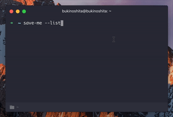

# save-me [](https://travis-ci.org/bukinoshita/save-me)

> 🔐 Save anything


## Install

```bash
$ npm install -g save-me
```
_Linux users will probably have to install xsel to use copy to clipboard option: `sudo apt install xsel`_


## Usage

```bash
$ save-me --help

  Usage:
    $ save-me                 Save an item
    $ save-me <item>          Search and get an item

  Example:
    $ save-me
    $ save-me <item> --copy
    $ save-me -l
    $ save-me -r <item>

  Options:
    -r, --remove              Remove item selected
    -l, --list                List all saved items
    -c, --copy                Copy item to clipboard
    -h, --help                Show help options
    -v, --version             Show version
```

## Demo




## Related

- [caesar-encrypt](https://github.com/bukinoshita/caesar) — :closed_lock_with_key: One of the simplest forms of encryption
- [save-local](https://github.com/bukinoshita/save-local) — Save stuff locally

## License

MIT © [Bu Kinoshita](https://bukinoshita.io)
